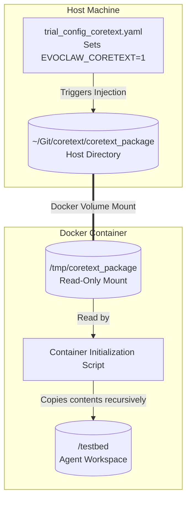

# Coretext Package Integration

The `coretext_package` is a specialized directory that integrates Coretext's memory, insights, and D-SDD (Dynamic System Design Document) methodology into the EvoClaw testing ecosystem. 

By injecting this package into the testing environment, EvoClaw can evaluate how proactive insights and established architectural "laws" improve the performance of cold-booted subagents (like the Gemini CLI) during complex software engineering trials.

## How the Injection Mechanism Works

To ensure the agent has access to these insights before it begins its evaluation tasks, the EvoClaw harness dynamically mounts and injects the `coretext_package` into the testbed workspace.

Here is the step-by-step lifecycle of the injection, managed by the `gemini-cli` agent runner (`harness/e2e/agents/gemini.py`):

1. **Triggering:** The runner checks for the presence of the `EVOCLAW_CORETEXT` environment variable (typically set via a trial configuration file, such as `trial_config_coretext.yaml`).
2. **Path Resolution:** If enabled, the runner locates the `coretext_package` on the host machine. By default, it looks at `~/Git/coretext/coretext_package`.
3. **Docker Mount:** The runner mounts this host directory into the agent's Docker container as a **read-only volume** at `/tmp/coretext_package`.
4. **Workspace Injection:** During the container's initialization sequence—right before the AI agent is given control—a startup script copies the entire contents of `/tmp/coretext_package` directly into the agent's active workspace (`/testbed`).

### Architecture Flow



## Customizing the Package Location

By default, the harness expects the package to be located at `~/Git/coretext/coretext_package`.

If your Coretext repository is located elsewhere, you can override this path by setting the `EVOCLAW_CORETEXT_PATH` environment variable before launching your trials:

```bash
export EVOCLAW_CORETEXT_PATH="/path/to/your/custom/coretext_package"
uv run python scripts/run_all.py --config trial_config_coretext.yaml
```

## Running Parallel Experiments

This modular injection design allows you to run parallel A/B experiments on the same codebase without duplicating the agent runner code. 

For example, you can launch a baseline trial (without Coretext) and a Coretext-enhanced trial simultaneously:

```bash
# Launch Baseline (Coretext Disabled)
uv run python scripts/run_all.py --config trial_config_baseline.yaml

# Launch Coretext Trial (Coretext Enabled)
uv run python scripts/run_all.py --config trial_config_coretext.yaml
```
